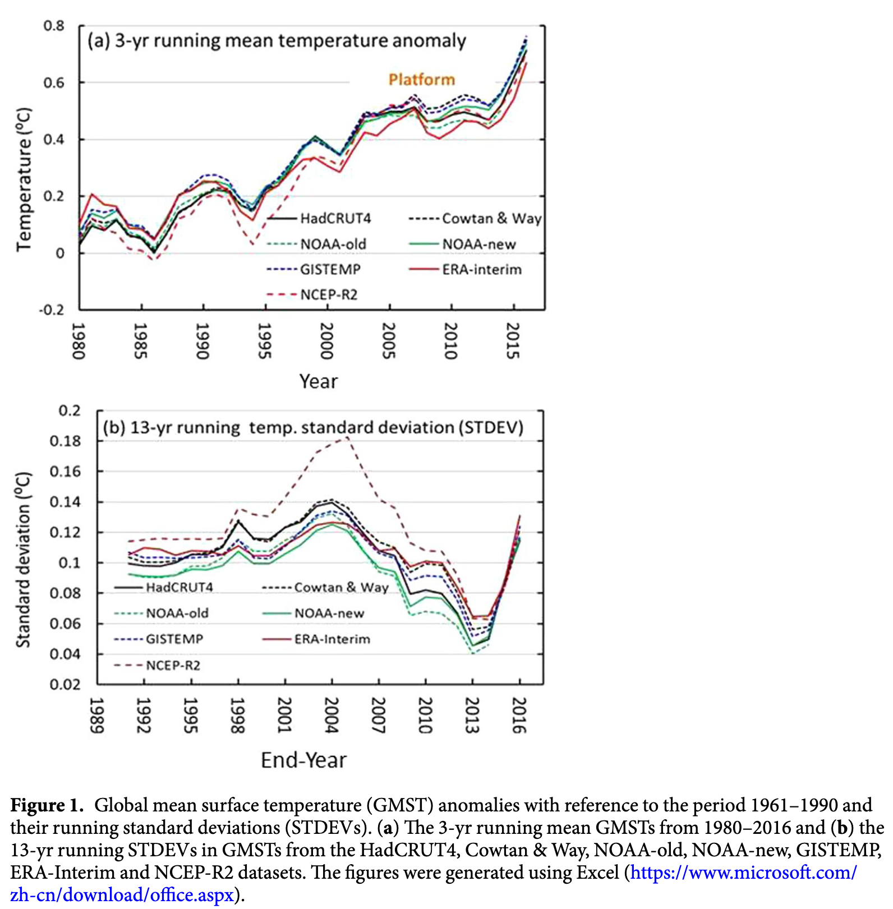

---

[[toc]]

#paper #scope/work/research/warmingHiatus

- citation_key: dai2018
- title: Identifying the Early 2000s Hiatus Associated with Internal Climate Variability
- author: Xin-Gang Dai, Ping Wang
- journal: Scientific Reports
- year: 2018
- doi: 10.1038/s41598-018-31862-z

---

> The hiatus is characterized as a near-zero trend on
> the ==decadal scale== corresponding to the maximum
> P-value via an F-test in statistics.

> The GWH is often attributed to ==internal climate variability==,
> ==external forcing==, or both.
> Recent cooling in the middle and eastern regions
> of the tropical Pacific has seemingly involved
> a phase change of the :u[Interdecadal Pacific Oscillation (IPO)]
> accompanying intensified trade winds.
> The GWH may also be associated with an :u[increase in aerosols
> in the stratosphere] during the period 2000–2010
> because aerosols can increase optical depth,
> which generates countervailing forces against global warming.
> The GWH may also be explained in part by :u[extensive heat uptake
> by the deep ocean] or :u[an extremely low number of sunspots]
> during the latest solar activity cycle.

> ..., which indicates that :u[infilling and bias correction
> in the datasets increase the temperature],
> especially during the early 2000s,
> probably due to rapid warming in the Arctic region.
> [@cohen2014](./ing-@cohen2014.md)

